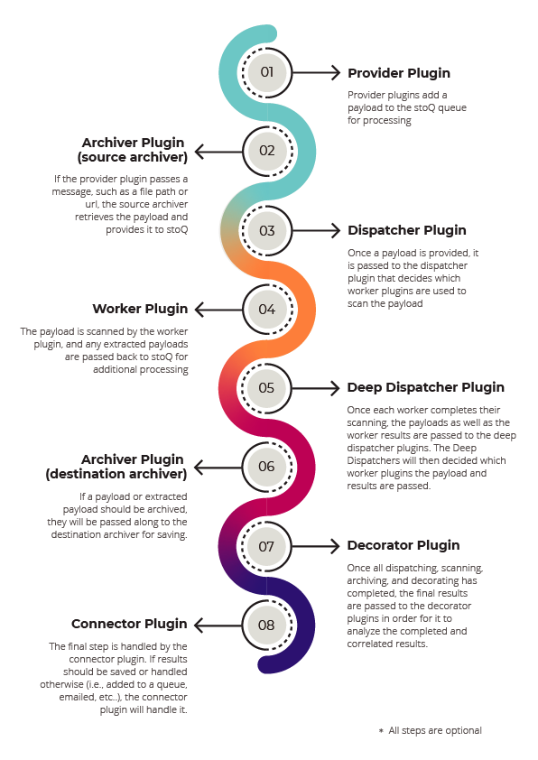

 

# Overview

stoQ is a automation framework that helps to simplify the mundane and repetitive
tasks an analyst is required to do. It enables analysts and DevSecOps teams to
quickly transition between different data sources, databases, decoders/encoders,
and numerous other tasks using enriched and consistent data structures. stoQ was
designed to be enterprise ready and scalable, while also being lean enough for
individual security researchers.

# Documentation

If you're interested in learning more about stoQ, to include how to develop your own plugins,
checkout the [full documentation](https://stoq-framework.readthedocs.io/).

# Installation

stoQ requires a minimum of python 3.6 and is recommended to be run in a [python venv](https://docs.python.org/3/library/venv.html).

Setup a \$STOQ_HOME (defaults to ~/.stoq) folder, the necessary plugin folder and a virtual environment:

    $ mkdir -p ~/.stoq/plugins
    $ python3 -m venv ~/.stoq/.venv
    $ source ~/.stoq/.venv/bin/activate

Installation via pip:

    $ pip3 install stoq-framework

Or, you can install the lastest master:

    $ git clone https://github.com/PUNCH-Cyber/stoq
    $ cd stoq && python3 setup.py install

# Plugins

stoQ currently has a wide range of publicly available plugins. These plugins are available separately in the [plugin repository](https://github.com/PUNCH-Cyber/stoq-plugins-public) and can be [easily installed](https://stoq-framework.readthedocs.io/en/latest/installation.html#installing-plugins) from stoQ.

Don't see a plugin you need? Check out the [plugin](https://stoq-framework.readthedocs.io/en/latest/dev/plugin_overview.html) documentation, or contact us.

# What is stoQ

stoQ was initially a collection of scripts that helped us solve problems we encountered
daily. These tasks, such as parsing an SMTP session, extracting attachments, scanning
them with a multitude of custom and open source tools, saving the results, and then
finally analyzing them took up an increasing amount of our team's resources. We spent
an ever increasing amount of time simply attempting to collect and extract data. This
took valuable resources away from our ability to actually find and analyze adversaries
targeting our networks.

We grew tired of being the hamster in a wheel and decided to do something about it.
In 2011, we began development of a framework that would not only tackle the problem
above, but also allow us to quickly change the flow of data and automated analytics,
quickly pivot to new databases to house the results, and simply be able to respond
to the adversaries changing their tactics, techniques, and procedures (TTPs).

Most importantly, our focus was to build a tool that would allow us to do what we
love to do -- defend networks from adversaries that are determined, focused, and relentless.

In 2015, after stoQ had been matured in multiple large scale operational networks, we
decided to open source our work in hopes of helping the wider Network Defense community.
Since then, we've been constantly enhancing stoQ thanks to the feedback and contributions
from the community of stoQ users.

# Why use stoQ

Over the years, there have been several other open source solutions that have been released
that have similar capabilities to stoQ. However, stoQ is fundamentally different in many ways
when compared to other solutions available. Some key differences are:

- Extremely lightweight and designed with simplicity in mind.
- A wide range of [publicly available plugins](https://github.com/PUNCH-Cyber/stoq-plugins-public).
- `stoQ` makes no assumptions about your workflow. Analysts decide everything, from where data
  originates, how it is scanned/decoded/processed, to where it is saved.
- Scalable in not only native/bare metal environments, but also using solutions such as
  Kubernetes, AWS Lambda, Google Cloud Functions, Azure Functions, and many more.
- Written to be easily and quickly extended. All you need is a plugin.
- Can be used in an enterprise environment or by individuals without the need for client/server
  infrastructure
- Overwhelming majority of code is covered by unit tests.
- All core functions and plugins leverage typing and are type-checked at commit.
- Actively developed since 2011, open source since 2015.
- Extensive up-to-date documentation.

# Philosophy

Our goal with stoQ has always been to simplify the mundane and automate the repetitive, ultimately
enabling network defenders to do what they do best -- focus on the threats. Since we began development,
this philosophy has not shifted. Our core philosophy for both design and development can be best
summarized by the [Zen of Python](https://www.python.org/dev/peps/pep-0020/):

    >>> import this
    The Zen of Python, by Tim Peters

    Beautiful is better than ugly.
    Explicit is better than implicit.
    Simple is better than complex.
    Readability counts.

# Architecture

One of the most powerful features in stoQ is its flexibility. Because stoQ is a framework, the majority
of the work actually happens within the plugins. stoQ itself is meant to orchestrate the communication
between the various plugins and normalize their results. stoQ makes no assumptions on the architecture
that works best for the user. Because of this, stoQ allows for a highly configurable and flexible
architecture that can be defined by the user.

For example, analysts can run stoQ against an individual file on their local computer, or against 100's of
millions of payloads that are extracted off the wire -- and everything in between. Payloads can be dynamically
routed to plugins using yara, TRiD, and even static attributes. Results can be saved with
ElasticSearch one day, then in Splunk the next, or both at the same time. Directories can be monitored
for new files, queueing solutions such as RabbitMQ or Google PubSub can be leveraged, or mailboxes can even
be monitored for new e-mails. No matter what an analyst wants to do with stoQ, it's simply a matter of
writing a plugin.

See the below workflow for an overview of the plugin architecture:

# Example Output

As an example of output from stoQ, let's scan a local file with ExifTool and get
the hashes of the payload:

    {
        "time": "...",
        "results": [
            {
                "payload_id": "00d2f069-d716-43ed-bc2f-b0bd295574d4",
                "size": 507904,
                "payload_meta": {
                    "should_archive": true,
                    "extra_data": {
                        "filename": "bad.exe"
                    },
                    "dispatch_to": []
                },
                "workers": [
                    {
                        "hash": {
                            "sha256": "47c6e9b102324ea6c54dd95ad3fdf4b48b18775053b105e241a371a3731488c0",
                            "md5": "16d9f6e5491d99beb46d7ab1500c1799",
                            "sha1": "9e6414bf2802c98fbd13172817db80380c5eeb6a"
                        },
                        "exif": {
                            "SourceFile": "/tmp/tmp3r4juo8e",
                            "ExifToolVersion": 11.11,
                            "FileName": "tmp3r4juo8e",
                            "Directory": "/tmp",
                            "FileSize": 507904,
                            "FileModifyDate": "...",
                            "FileAccessDate": "...",
                            "FileInodeChangeDate": ".",
                            "FilePermissions": 600,
                            "FileType": "Win32 EXE",
                            "FileTypeExtension": "EXE",
                            "MIMEType": "application/octet-stream",
                            "MachineType": 332,
                            "TimeStamp": "2013:04:20 10:50:10-04:00",
                            "ImageFileCharacteristics": 258,
                            "PEType": 267,
                            "LinkerVersion": 9.0,
                            "CodeSize": 386048,
                            "InitializedDataSize": 120832,
                            "UninitializedDataSize": 0,
                            "EntryPoint": 208320,
                            "OSVersion": 5.0,
                            "ImageVersion": 0.0,
                            "SubsystemVersion": 5.0,
                            "Subsystem": 2
                        }
                    }
                ],
                "archivers": {},
                "plugins_run": {
                    "workers": [
                        [
                            "exif",
                            "hash"
                        ]
                    ],
                    "archivers": []
                },
                "extracted_from": null,
                "extracted_by": null
            }
        ],
        "request_meta": {
            "archive_payloads": true,
            "source": null,
            "extra_data": {}
        },
        "errors": {},
        "decorators": {},
        "scan_id": "4d053d5e-9f4e-417b-8f0e-deea0d45449d"
    }

Or, carve a few executable files out of a Microsoft Word document:

    {
        "time": "...",
        "results": [
            {
                "payload_id": "e777051a-832b-489f-b74c-9949b2c9a2ce",
                "size": 558592,
                "payload_meta": {
                    "should_archive": true,
                    "extra_data": {
                        "filename": "sample_doc_with_pe.doc"
                    },
                    "dispatch_to": []
                },
                "workers": [
                    {
                        "exif": {
                            "SourceFile": "/tmp/tmpbqtisxjd",
                            "ExifToolVersion": 11.11,
                            "FileName": "tmpbqtisxjd",
                            "Directory": "/tmp",
                            "FileSize": 558592,
                            "FileModifyDate": "...",
                            "FileAccessDate": "...",
                            "FileInodeChangeDate": "...",
                            "FilePermissions": 600,
                            "FileType": "DOC",
                            "FileTypeExtension": "DOC",
                            "MIMEType": "application/msword",
                            "Identification": 42476,
                            "LanguageCode": 1033,
                            "DocFlags": 4616,
                            "System": 0,
                            "Word97": 0,
                            "Author": "xxxxxxxxxxxx",
                            "Template": "Normal",
                            "LastModifiedBy": "xxxxxxxxxxxx",
                            "Software": "Microsoft Office Word",
                            "CreateDate": "2017:11:13 21:27:00",
                            "ModifyDate": "2017:11:13 21:28:00",
                            "Security": 0,
                            "CodePage": 1252,
                            "Company": "",
                            "CharCountWithSpaces": 20,
                            "AppVersion": 14.0,
                            "ScaleCrop": 0,
                            "LinksUpToDate": 0,
                            "SharedDoc": 0,
                            "HyperlinksChanged": 0,
                            "TitleOfParts": "",
                            "HeadingPairs": [
                                "Titulo",
                                1
                            ],
                            "CompObjUserTypeLen": 36,
                            "CompObjUserType": "Documento do Microsoft Word 97-2003",
                            "LastPrinted": "0000:00:00 00:00:00",
                            "RevisionNumber": 2,
                            "TotalEditTime": 1,
                            "Words": 3,
                            "Characters": 18,
                            "Pages": 1,
                            "Paragraphs": 1,
                            "Lines": 1
                        },
                        "hash": {
                            "sha256": "4e3a682b2187f7c722b88af9bff5292fd7beb4d77233d1b3bc46f0bfc4891068",
                            "md5": "137720063880f80270a61181b021d000",
                            "sha1": "08bc0a52ee27ad0ceaa87bf394b1faa7a43bf27e"
                        }
                    }
                ],
                "archivers": {},
                "plugins_run": {
                    "workers": [
                        [
                            "pecarve",
                            "exif",
                            "hash"
                        ]
                    ],
                    "archivers": []
                },
                "extracted_from": null,
                "extracted_by": null
            },
            {
                "payload_id": "471b49f3-ea99-481f-a0a3-502826e69c73",
                "size": 31232,
                "payload_meta": {
                    "should_archive": true,
                    "extra_data": {
                        "offset": 11367
                    },
                    "dispatch_to": []
                },
                "workers": [
                    {
                        "exif": {
                            "SourceFile": "/tmp/tmpyi0yx_wf",
                            "ExifToolVersion": 11.11,
                            "FileName": "tmpyi0yx_wf",
                            "Directory": "/tmp",
                            "FileSize": 31232,
                            "FileModifyDate": "...",
                            "FileAccessDate": "...",
                            "FileInodeChangeDate": "...",
                            "FilePermissions": 600,
                            "FileType": "Win32 EXE",
                            "FileTypeExtension": "EXE",
                            "MIMEType": "application/octet-stream",
                            "MachineType": 332,
                            "TimeStamp": "2016:07:15 21:44:45-04:00",
                            "ImageFileCharacteristics": 258,
                            "PEType": 267,
                            "LinkerVersion": 14.0,
                            "CodeSize": 8192,
                            "InitializedDataSize": 22528,
                            "UninitializedDataSize": 0,
                            "EntryPoint": 10496,
                            "OSVersion": 10.0,
                            "ImageVersion": 10.0,
                            "SubsystemVersion": 10.0,
                            "Subsystem": 2,
                            "FileVersionNumber": "10.0.14393.0",
                            "ProductVersionNumber": "10.0.14393.0",
                            "FileFlagsMask": 63,
                            "FileFlags": 0,
                            "FileOS": 262148,
                            "ObjectFileType": 1,
                            "FileSubtype": 0,
                            "LanguageCode": "0409",
                            "CharacterSet": "04B0",
                            "CompanyName": "Microsoft Corporation",
                            "FileDescription": "Windows Calculator",
                            "FileVersion": "10.0.14393.0 (rs1_release.160715-1616)",
                            "InternalName": "CALC",
                            "LegalCopyright": "Microsoft Corporation. All rights reserved.",
                            "OriginalFileName": "CALC.EXE",
                            "ProductName": "Microsoft Windows Operating System",
                            "ProductVersion": "10.0.14393.0",
                            "Warning": "Possibly corrupt Version resource"
                        },
                        "hash": {
                            "sha256": "c74f41325775de4777000161a057342cc57a04e8b7be17b06576412eff574dc5",
                            "md5": "40e85286357723f326980a3b30f84e4f",
                            "sha1": "2e391131f9b77a8ec0e0172113692f9e2ccceaf0"
                        }
                    }
                ],
                "archivers": {},
                "plugins_run": {
                    "workers": [
                        [
                            "exif",
                            "hash"
                        ]
                    ],
                    "archivers": []
                },
                "extracted_from": "e777051a-832b-489f-b74c-9949b2c9a2ce",
                "extracted_by": "pecarve"
            },
            {
                "payload_id": "5a6279a4-df1d-4575-8587-286f5938839d",
                "size": 507904,
                "payload_meta": {
                    "should_archive": true,
                    "extra_data": {
                        "offset": 50688
                    },
                    "dispatch_to": []
                },
                "workers": [
                    {
                        "exif": {
                            "SourceFile": "/tmp/tmpsiaa54tm",
                            "ExifToolVersion": 11.11,
                            "FileName": "tmpsiaa54tm",
                            "Directory": "/tmp",
                            "FileSize": 507904,
                            "FileModifyDate": "...",
                            "FileAccessDate": "...",
                            "FileInodeChangeDate": "...",
                            "FilePermissions": 600,
                            "FileType": "Win32 EXE",
                            "FileTypeExtension": "EXE",
                            "MIMEType": "application/octet-stream",
                            "MachineType": 332,
                            "TimeStamp": "2013:04:20 10:50:10-04:00",
                            "ImageFileCharacteristics": 258,
                            "PEType": 267,
                            "LinkerVersion": 9.0,
                            "CodeSize": 386048,
                            "InitializedDataSize": 120832,
                            "UninitializedDataSize": 0,
                            "EntryPoint": 208320,
                            "OSVersion": 5.0,
                            "ImageVersion": 0.0,
                            "SubsystemVersion": 5.0,
                            "Subsystem": 2
                        },
                        "hash": {
                            "sha256": "47c6e9b102324ea6c54dd95ad3fdf4b48b18775053b105e241a371a3731488c0",
                            "md5": "16d9f6e5491d99beb46d7ab1500c1799",
                            "sha1": "9e6414bf2802c98fbd13172817db80380c5eeb6a"
                        }
                    }
                ],
                "archivers": {},
                "plugins_run": {
                    "workers": [
                        [
                            "exif",
                            "hash"
                        ]
                    ],
                    "archivers": []
                },
                "extracted_from": "e777051a-832b-489f-b74c-9949b2c9a2ce",
                "extracted_by": "pecarve"
            }
        ],
        "request_meta": {
            "archive_payloads": true,
            "source": null,
            "extra_data": {}
        },
        "errors": {},
        "decorators": {},
        "scan_id": "04f9aec3-afc7-4fa1-b179-73e46c074e81"
    }
